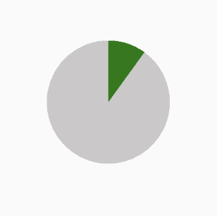

# Android progressbars [  ](https://bintray.com/sjowl/maven/progressbar/_latestVersion)

### Gradle
```Gradle
repositories {
    maven {url  "https://dl.bintray.com/sjowl/maven" }
}

compile 'au.sjowl.libs.view.progressbar:progressbar:0.0.1'
```

### PieProgressBar
```xml
<au.sjowl.lib.view.progressbar.PieProgressView
        ...
        android:layout_width="100dp"
        android:layout_height="wrap_content"
        app:colorBackground="@color/colorPrimary"
        app:colorProgress="@color/colorAccent"
        app:progress="10" />
```


